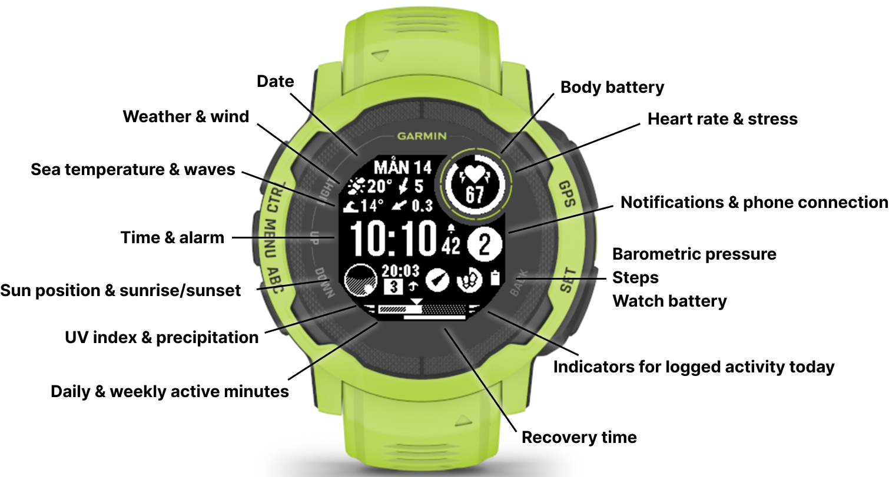

# Undertow

Garmin watchface for Instinct 2 with weather, ocean data, plenty of stats and a bit of OpenClaw integration.

<p align="center">
  
</p>

## Features

### The basics
- Partial updates every second for seconds, heart rate & notifications
- Battery-optimized updates of everything

### Weather
- Weather & ocean data provided by [YR](https://www.yr.no/) via [Wake Service](https://github.com/jeffton/wake-service)
- Ocean data falls back to altidude display when far from the ocean

### OpenClaw integration
- **Location awareness**: Can log your location when fetching weather via [Wake Service](https://github.com/jeffton/wake-service), so that your [OpenClaw](https://openclaw.ai) bot knows where you are.
- **Activity feedback**: Can ping your Wake Service when you save an activity, so that your bot can check stats on Garmin Connect and give feedback. My OpenClaw skill for Garmin Connect is [here](https://github.com/jeffton/garmin-skill), but you can use any available Garmin skill for this.

## Setup

### Wake Service
This watch face relies on [Wake Service](https://github.com/jeffton/wake-service) for weather data and OpenClaw integration. Deploy your own instance of the service.

### Watchface configuration

1. Copy the template file:
   ```bash
   cp source/background/WakeServiceSettings.mc.template source/background/WakeServiceSettings.mc
   ```

2. Edit `WakeServiceSettings.mc` with your values:
   ```monkey-c
   module WakeServiceSettings {
     const URL = "https://your-wake-service.example.com/sync";
     const API_KEY = "your-api-key-here";
   }
   ```

3. The real `WakeServiceSettings.mc` is in .gitignore


## Compatibility

- Built for Garmin Instinct 2 (176x176 display). Should be trivial to add support for other Instinct models with the same resolution. Other Garmin watches would require reworking the view as everything is drawn in black and white at fixed coordinates.

## AI usage
- Most of this watchface is hand-coded (made it before the recent AI explosion)
- Later features have been prompted with Codex & carefully reviewed

